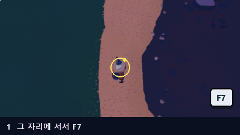
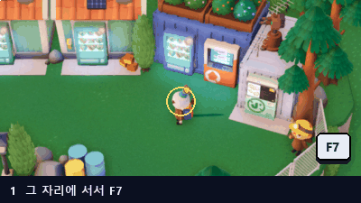
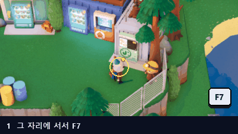
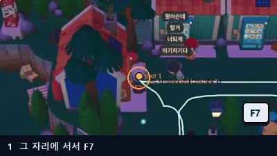
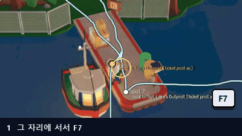
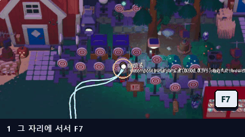

  

<h1 align="center">vinterbot</h1>

  루트를 한 번 가르치면 알아서 반복합니다: 낚시, 상점, 보트 여행 — <b>Longvinter</b> 용, Windows. 
  <a href="../../releases/latest"><b>최신 버전 받기</b></a> ·
  <a href="https://discord.gg/Gxe3cxADV">Discord</a> ·
  <a href="README.md">English</a>

이 저장소에는 배포 파일만 있습니다 (파일 하나: `autofish-<버전>.exe`).

| 전초기지 사이 보트 여행 | 부두에서 물고기 떼 낚시 |
|---|---|
|  |  |

## 무엇을 하나요

게임에서 루트를 한 번 걸으면서, 일이 일어날 곳에 동작을 추가합니다 (여기서 낚시, 저기서 판매, 보트 타기...).
그러면 vinterbot 이 같은 루트를 혼자 걸으며 매 바퀴 그 동작들을 합니다. 화면만 읽고 (게임 파일은 건드리지 않음)
키보드와 마우스로 플레이합니다.

- **학습 & 반복** — 지도 어디든, 어떤 루트든. 출발점으로 돌아오는 반복 루트는 원하는 만큼 반복합니다.
- **동작** — 낚시, 물고기 판매, 잡화점 판매 (전부), 구매, 보트 여행, 분해, 버리기, 건물 들어가기 / 나가기,
  보관함에 넣기 / 꺼내기, 요리.
- **스스로 문제 해결** — 보이는 화면으로 위치를 찾고, 길을 막은 플레이어를 피해 가며, (치명적인) 바다에는 절대
  들어가지 않습니다. 게임이 튕기거나 서버에서 끊기면 다시 켜고, 다시 접속해서 이어 갑니다.
- **텔레그램 원격 조종** — 휴대폰에서 상태, 스크린샷, 실행 / 정지 / 일시정지. 막히면 메시지로 알려 줍니다.
- 새 버전이 나오면 실행할 때 **스스로 업데이트**합니다.
- Windows 표시 언어에 따라 한국어 또는 영어.

## 필요한 것

- Windows 10 또는 11 (64비트), Longvinter (Steam).
- 게임 화면이 **16:9**, 1280x720 이상 (전체 화면, 테두리 없는 창, 창 모드 모두 가능).
- 실행 중에는 **모니터를 켜 두세요** (밝기를 낮추는 건 괜찮습니다). 모니터를 끄면 Windows 가 1024x768 로 바뀝니다.
- 첫 실행 때 설치되는 입력 드라이버 (아래): 재시작 한 번.

## 설치

1. [Releases](../../releases/latest)에서 `autofish-<버전>.exe` 를 받으세요 (또는 [Discord](https://discord.gg/Gxe3cxADV) 의 #download: 먼저 #verify 에서 코드를 입력하세요).
2. **전용 폴더**에 두세요. 예: `C:\vinterbot\`. 루트는 그 옆 `routes\` 폴더에 저장됩니다.
3. 실행하세요. Windows 가 *"Windows의 PC 보호"* 를 띄우면 (코드 서명이 없어서): **추가 정보 → 실행**.
4. **첫 실행 때만:** 입력 드라이버를 설치합니다 — Windows 가 관리자 권한을 묻고 — 그 뒤 **Windows 를 다시
   시작**하라고 합니다. 재시작 후 다시 실행하세요. (키보드와 마우스 입력이 이 드라이버를 거칩니다.)

실행할 때마다 스스로 압축을 풀기 때문에 시작에 몇 초 걸립니다.

## 빠른 시작

1. Longvinter 를 켜고 서버에 접속한 뒤 vinterbot 을 실행하세요.
2. **루트 학습**
   - 루트가 시작될 곳에 서세요.
   - **새 루트 학습...** 을 누르고 이름을 정하세요. 루트가 출발점에서 끝나면 **반복 루트** 를 체크하세요 (대부분
     그렇습니다: 낚시, 판매, 돌아오기).
   - vinterbot 이 카메라를 끝까지 줌 아웃합니다 (루트는 줌 아웃 상태로 학습하고 실행합니다). 게임에서 루트를 걸으세요.
   - 무언가 할 곳에서 **F7** 을 누르면 동작 창이 열립니다 ([동작](#동작) 참고).
   - **F9** 로 끝냅니다. 반복 루트는 출발점으로 돌아와야 끝납니다.
3. **실행**: 루트를 고르고 **실행** 을 누르거나 (반복 루트는 몇 바퀴인지 묻습니다: 0 = 멈출 때까지) 게임에서 **F5**.
   **F5** 는 일시정지 / 계속, **F9** (또는 **정지**) 는 멈춤입니다.

실행 중에는 루트, 지점, 지금 하는 동작이 게임 위에 표시됩니다 (본인에게만 보입니다: 스크린샷과 녹화에는 찍히지
않습니다).

## 동작

캐릭터가 서 있는 곳에서 **F7** (학습 중, 또는 나중에 루트 위에 서서) → 종류 선택 → 내용 입력 → **추가**.
대부분의 동작은 그다음 **게임에서 대상을 가리키라고** 합니다 — 자판기, 표지판, 분해기, 조리기구 — 마우스로
가리키고 **F7** 을 다시 누르세요. 오버레이가 원, 화살표, 고리로 도와줍니다. 한 지점의 동작들은 순서대로 합니다.
아이템은 **아이템 찾기...** 로 고릅니다 (영어 / 한국어 이름, `ㅇㅁㅌ` 같은 초성, 아이템 코드. ☆ 는 즐겨찾기로
맨 위에 고정).

| 동작 | 하는 일 | 설정 방법 |
|---|---|---|
| **낚시** | 닿는 거리 (설정한 원) 안의 물고기 떼에 던져서, N 마리를 잡거나 가방이 찰 때까지. |  |
| **물고기 판매** | 물고기 자판기에서 가방의 물고기를 팝니다. |  |
| **잡화점 판매** | J 잡화점에서 가방의 **모든 것**을 팝니다. |  |
| **구매** | 자판기에서 고른 아이템을 N 개 삽니다 (0 = 가방이 찰 때까지). |  |
| **보트 여행** | 매표소 표지판에서 고른 곳으로 보트를 탑니다. 나머지 루트는 도착한 곳에서 학습합니다. |  |
| **분해** | 고른 아이템을 순서대로 분해기에 넣고 부품을 받습니다. 가방이 차면 두 번째 목록의 아이템을 버립니다. |  |
| **버리기** | 고른 아이템을 버립니다. |  |
| **건물 들어가기 / 나가기** | 문으로 드나듭니다. 나머지 루트는 안에서 학습합니다. 나가기: 문 안쪽 매트 위에 서세요. | |
| **보관함에 넣기 / 꺼내기** | 보관함에 고른 아이템을 넣거나 꺼냅니다 (안 고르면 전부). 보관함 바로 옆에 서세요. | |
| **요리** | 조리기구 (모닥불, 그릴...) 에 레시피 재료를 넣고 요리를 꺼냅니다. | |

낚시는 게임과 같습니다: 동작의 지점이 물고기 떼가 나타나는 곳 가까이에 있어야 합니다. 물고기 떼를 향해 걸어가지
않고, 닿는 거리에 올 때까지 기다립니다.

루트 목록에서: **여기에 동작 추가...**, **선택한 동작 뒤에 추가...**, **편집...** (또는 더블클릭), **삭제**,
한 지점 안에서 순서는 **▲ / ▼**. **이름 바꾸기** 로 루트 이름을 바꿉니다.

## 단축키

| 키 | 대기 중 | 학습 중 | 실행 중 |
|---|---|---|---|
| **F5** | 고른 루트 실행 | — | 일시정지 / 계속 |
| **F7** | 캐릭터가 선 곳에 동작 추가 | 여기에 동작 추가 | — |
| **F9** | — | 학습 끝내기 | 정지 |

게임 자체의 F7 (관리자 순간이동) 은 vinterbot 이 켜져 있는 동안 게임에 전달되지 않습니다.

## 구독

**낚시는 무료입니다.** 판매, 잡화점, 구매, 보트 여행, 분해, 버리기, 건물, 보관함, 요리, 텔레그램 원격 조종은
**Google 계정**에 묶인 구독이 필요합니다:

- **구독** → **Google로 로그인** (브라우저에 Google 페이지가 열립니다), 결제는 **구독하기...**, 변경이나 해지는
  **구독 관리**. 유료 동작이 있는 루트는 목록에 표시됩니다.
- PC 5대까지 로그인할 수 있습니다. **계정당 한 번에 봇 하나만** 실행됩니다: 다른 PC 에서 유료 루트를 시작하면
  넘겨받을지 묻습니다 (원래 PC 는 2분 안에 멈춥니다).

## 텔레그램 원격 조종

1. 텔레그램에서 **@BotFather** 에게 `/newbot` 으로 봇을 만들고, 그 토큰을 vinterbot 의 **텔레그램 원격 조종**
   창에 붙여 넣으세요.
2. 그 창에 표시된 코드로 내 봇에게 `/pair 코드` 를 보내세요.
3. 이후: `/status`, `/screen` (스크린샷), `/log`, `/routes`, `/run 이름 [바퀴]`, `/pause`, `/resume`, `/stop`,
   `/open_vinter` / `/close_vinter` (게임 켜기 / 끄기), `/remote_control` (채팅에서 방향키와 클릭). 실행이
   막히거나, 게임을 잃거나, 끝나면 메시지를 보냅니다.

## 팁 & 문제 해결

- **밤:** 낮에 학습한 루트는 밤에 처음엔 장소를 못 알아볼 수 있습니다. 실행하면서 밤 모습을 배웁니다. 밤에 루트를
  하나 더 학습해도 됩니다.
- **막힘** (플레이어나 물건이 몇 분 동안 길을 막음): 약 6분 동안 다시 시도하고, 루트 폴더에 스크린샷을 남긴 뒤
  멈춥니다. `routes\<이름>\runs.log` 에 매 실행이 기록됩니다.
- **물에 절대 들어가지 않기** (기본으로 켜짐) 는 바다로 걸어 들어가는 걸 막습니다. 치명적인 물이 없는 맵에서만 끄세요.
- 실행 중에는 게임 창이 **16:9** 로, 앞에 있어야 합니다. 게임을 최소화하면 돌아올 때까지 기다립니다.
- 루트는 경로 위 어디서든 시작할 수 있습니다: 가장 가까운 지점을 찾아 이어 갑니다.

## 주의

vinterbot 은 플레이를 자동화합니다. 자동화는 게임이나 서버의 규칙에 어긋날 수 있습니다 — 허용되는 곳에서
(예: 본인이나 친구의 서버) 본인 책임으로 사용하세요.
