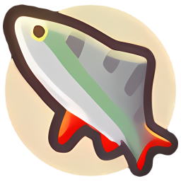
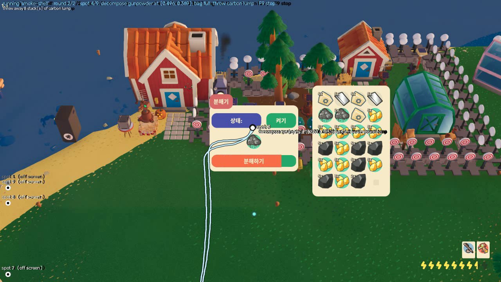
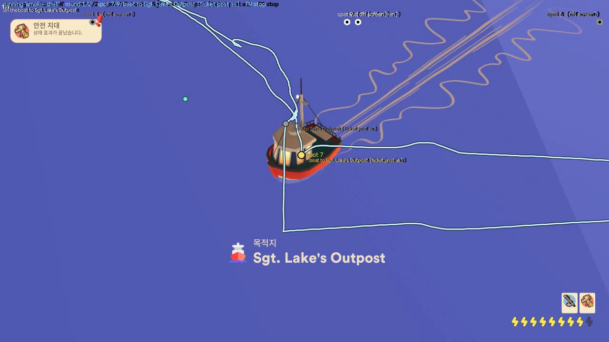
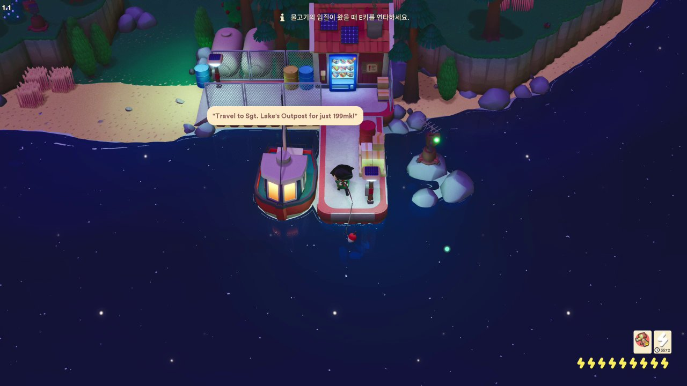
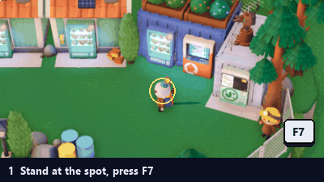
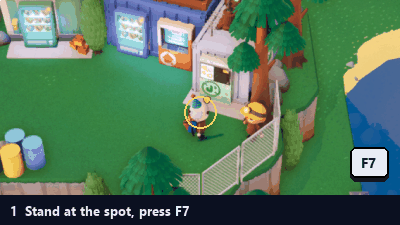
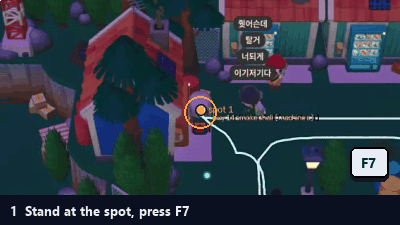
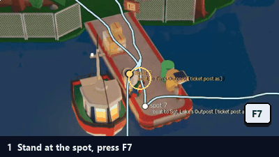
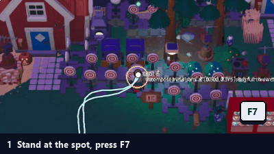
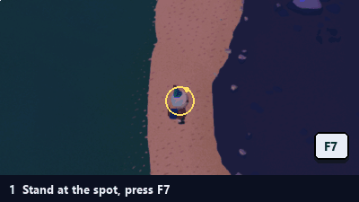

  

<h1 align="center">vinterbot</h1>

  Teach a route once, let it run: fishing, shops, boat trips — for <b>Longvinter</b>, on Windows. 
  <a href="../../releases/latest"><b>Download</b></a> ·
  <a href="https://discord.gg/Gxe3cxADV">Discord</a> ·
  <a href="README.ko.md">한국어</a>

| Boat trip between two outposts | Fishing a school from the pier |
|---|---|
|  |  |

## What it does

Automate everything you want in LongVinter (fish here, sell there, take the boat...).
vinterbot then walks the same route by itself, round after round, and does those actions on the way.

- **Teach & repeat** — any route, on any part of the map; loops (back to the start) repeat as many rounds as you like.
- **Actions** — fish, sell fish, sell everything at J's store, buy, boat trips, decompose, discard, enter / exit a
  building, store in / fetch from a storage box, cook.
- **Telegram remote** — status, screenshots, start / stop / pause from your phone; a message when it gets stuck.

## Requirements

- Windows 10 or 11 (64-bit) and Longvinter (Steam).
- The game at a **16:9** size, 1280x720 or larger (fullscreen, borderless or windowed).
- Keep Graphic Quality <Water>: `Low`
- **Keep the monitor on** while it runs (dimmed is fine)

## Install

1. Download `autofish-<version>.exe` from [Releases](../../releases/latest) (or from #download on our [Discord](https://discord.gg/Gxe3cxADV): enter the code in #verify first).
2. Put it in a **folder of its own**, e.g. `C:\vinterbot\`. Your routes are saved next to it, in `routes\`.
3. Run it. Windows may say *"Windows protected your PC"* (the exe isn't code-signed): **More info → Run anyway**.
4. **First launch only:** it installs its input driver — Windows asks for administrator rights — and then asks you
   to **restart Windows**. After the restart, run it again. (The keyboard and mouse input goes through this driver.)

Starting takes a few seconds: the program unpacks itself each time.

## Quick start

1. Start Longvinter and join your server. Run vinterbot.
2. **Teach a route**
   - Stand where the route starts.
   - Click **Teach new...**, give it a name. Tick **Loop** if the route ends where it starts (most do: fish, sell,
     walk back).
   - vinterbot zooms the camera all the way out (routes are taught and run zoomed out). Walk the route in the game.
   - Where something should happen, press **F7**: the action dialog opens (see [Actions](#actions)).
   - Press **F9** to finish. A loop finishes only back at the start.
3. **Run it**: pick the route, click **Run** (a loop asks how many rounds: 0 = until stopped), or press **F5** in the
   game. **F5** pauses and carries on, **F9** (or **Stop**) stops.

The route, its spots and the current action are drawn over the game while it runs (only you see them: the overlay is
kept out of screenshots and recordings).

## Actions

Press **F7** where the character stands (while teaching, or later while standing on the route) → pick the type →
fill in the form → **Add**. Most actions then ask you to **point at the target in the game** — the machine, the post,
the decomposer, the cooker — with the mouse and press **F7** again; the overlay shows a circle, arrow or ring to help.
Actions at one spot are done in order. Items are picked with **Find items...** (English or Korean name, Korean initial
consonants like `ㅇㅁㅌ`, or the item code; ☆ keeps favorites on top).

| Action | What it does | How it's set |
|---|---|---|
| **fish** | Casts at a fish school within reach (the circle you set) until N catches, or until the bag is full. |  |
| **sell** | At the fish machine: sells the fish in the bag. |  |
| **sell J's store** | At J's general store: sells **everything** in the bag. |  |
| **buy** | At a vending machine: buys the picked item, N of them (0 = until the bag is full). |  |
| **travel** | Takes the boat from a ticket post to the picked place; the rest of the route is taught there. |  |
| **decompose** | Puts the picked items into the decomposer, in order, and takes the parts. Bag full: throws away the items in its second list. |  |
| **discard** | Throws the picked items away. |  |
| **enter / exit building** | Through a door; the rest of the route is taught inside. Exit: stand on the mat inside the door. | |
| **store in box / fetch from box** | A storage box: puts in / takes out the picked items (none picked = all). Stand right next to the box. | |
| **cook** | At a cooker (bonfire, grill...): puts in the recipe's items and takes out the dishes. | |

Fish the way the game does: the action's spot must be near a place where schools appear. It never walks out to a
school, it waits for one in reach.

In the route list: **Add action here...**, **Add after picked...**, **Edit...** (or double-click), **Remove**, and
**▲ / ▼** to reorder within a spot. **Rename** renames a route.

## Hotkeys

| Key | Idle | While teaching | While running |
|---|---|---|---|
| **F5** | run the picked route | — | pause / carry on |
| **F7** | add an action where the character stands | add an action here | — |
| **F9** | — | finish teaching | stop |

The game's own F7 (an admin teleport) is kept from the game while vinterbot runs.

## Subscription

**Fishing is free.** Selling, J's store, buying, boat trips, decomposing, discarding, buildings, boxes, cooking and the
Telegram remote need a subscription, held by your **Google account**:

- **Subscription** → **Sign in with Google** (your browser opens Google's page), then **Subscribe...** to pay, or
  **Manage subscription** to change or cancel it. Routes with paid actions are marked in the list.
- Sign in on up to 5 PCs. **One bot runs at a time per account**: starting a paid route on another PC offers to take
  over (the other one stops within 2 minutes).

## Telegram remote

1. In Telegram, ask **@BotFather** for `/newbot` and paste its token into vinterbot's **Telegram remote** window.
2. Send your bot `/pair CODE` with the code shown in that window.
3. Then: `/status`, `/screen` (a screenshot), `/log`, `/routes`, `/run NAME [ROUNDS]`, `/pause`, `/resume`,
   `/stop`, `/open_vinter` / `/close_vinter` (start / close the game), `/remote_control` (arrow keys and clicks
   from the chat). It messages you when a run gets stuck, loses the game or ends.

## Tips & troubleshooting

- **Night:** a route taught by day may not recognise places at night at first; it learns night views as it runs.
  Teaching a second route at night also works.
- **Stuck** (a player or object in the way for minutes): it retries for ~6 minutes, saves a screenshot in the
  route's folder, then stops. `routes\<name>\runs.log` records each run.
- **"Never step into water"** (on by default) stops it walking into the sea; turn it off only on maps without deadly
  water.
- The game window must stay **16:9** and in front while it runs; a minimised game is waited for.
- A route can be started anywhere along its path: it finds the nearest point and carries on.

## Disclaimer

vinterbot automates play. Automation may be against a game's or a server's rules — use it where it's allowed (e.g.
on your own or a friend's server), at your own risk.
